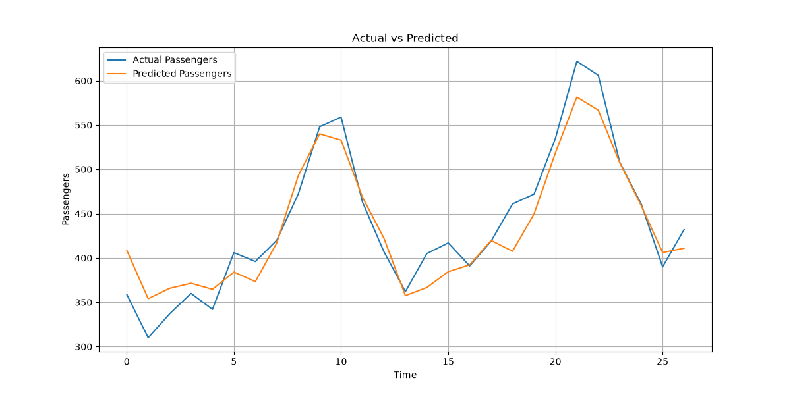
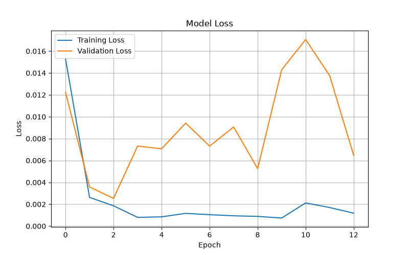
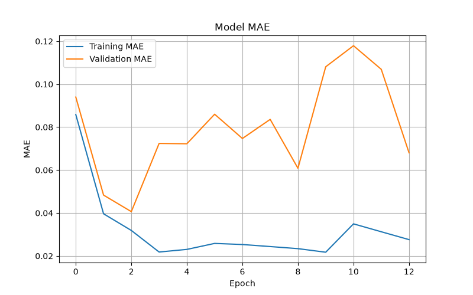

<div align="center">

# ✈️ Airline Passenger Forecasting using Recurrent Neural Network (RNN)

### 📈 Deep Learning Time Series Forecasting using TensorFlow & Keras

<p align="center">


</p>

---

### 🧠 Predicting Future Airline Passenger Traffic using Deep Learning

*A complete Time Series Forecasting project built using Recurrent Neural Networks (RNN), TensorFlow, and Keras.*

</div>

---

# 📑 Table of Contents

- [📖 Project Overview](#-project-overview)
- [✨ Key Features](#-key-features)
- [🧠 What is RNN?](#-what-is-rnn)
- [📊 Dataset Information](#-dataset-information)
- [📂 Project Structure](#-project-structure)
- [⚙️ Technologies Used](#-technologies-used)

---

# 📖 Project Overview

Forecasting future demand is one of the most important applications of Artificial Intelligence.

In this project, a **Recurrent Neural Network (RNN)** has been developed to forecast future airline passenger counts based on historical monthly passenger data.

Unlike traditional Neural Networks, **RNNs can remember previous information**, making them highly suitable for sequential and time-series data.

The model learns passenger travel patterns from previous months and predicts the passenger count for the next month.

This project demonstrates the complete Deep Learning workflow, including:

- Data Collection
- Data Preprocessing
- Sequence Generation
- Data Normalization
- RNN Model Development
- Model Training
- Model Evaluation
- Performance Visualization
- Model Saving

---

# ✨ Key Features

✔ Modular Object-Oriented Programming (OOP)

✔ Professional Project Structure

✔ Data Scaling using MinMaxScaler

✔ Automatic Time-Series Sequence Generation

✔ Early Stopping for Better Generalization

✔ TensorFlow/Keras Implementation

✔ Model Performance Evaluation

✔ Automatic Graph Generation

✔ Saved Trained Model (.keras)

✔ Clean & Reusable Code

✔ GitHub Portfolio Ready

---

# 🧠 What is RNN?

A **Recurrent Neural Network (RNN)** is a type of Artificial Neural Network specially designed for **Sequential Data**.

Unlike a traditional neural network, an RNN remembers information from previous time steps.

This memory allows it to understand patterns over time.

### Example

Instead of seeing only the current month's passengers:

```
January = 112
```

The RNN observes a sequence:

```
January   = 112
February  = 118
March     = 132
April     = 129
May       = 121
...
```

Using previous months, the RNN predicts the next month's passenger count.

---

# 📊 Dataset Information

## Dataset Name

**AirPassengers Dataset**

---

## Description

The AirPassengers dataset contains the monthly total number of international airline passengers from **January 1949** to **December 1960**.

This is one of the most popular datasets used for learning Time Series Forecasting.

---

## Dataset Summary

| Attribute | Value |
|-----------|-------|
| Total Records | **144** |
| Features | **2** |
| Missing Values | **0** |
| Target Variable | **#Passengers** |
| Data Type | Time Series |

---

## Dataset Columns

| Column | Description |
|---------|-------------|
| Month | Month-Year |
| #Passengers | Monthly Passenger Count |

---

## Statistical Summary

| Metric | Value |
|---------|-------|
| Total Samples | **144** |
| Minimum Passengers | **104** |
| Maximum Passengers | **622** |
| Average Passengers | **280.30** |
| Standard Deviation | **119.97** |

---

# 📂 Project Structure

```text
Task_2_Intermediate
│
├── datasets
│   └── AirPassengers.csv
│
├── src
│   └── RNN
│       ├── RNN_Main.py
│       ├── RNN_Model.py
│       ├── RNN_Training.py
│       └── RNN_Evaluation.py
│
├── outputs
│   ├── RNN_Model.keras
│   ├── RNN_Prediction.png
│   ├── RNN_Loss.png
│   └── RNN_MAE.png
│
├── requirements.txt
│
└── README.md
```

---

# ⚙️ Technologies Used

| Technology | Purpose |
|------------|---------|
| Python | Programming Language |
| TensorFlow | Deep Learning Framework |
| Keras | Neural Network API |
| NumPy | Numerical Computing |
| Pandas | Data Manipulation |
| Matplotlib | Data Visualization |
| Scikit-Learn | Data Preprocessing & Metrics |
| MinMaxScaler | Feature Scaling |
| EarlyStopping | Prevent Overfitting |

---

## 📌 Project Objectives

The objectives of this project are:

- Learn the fundamentals of Recurrent Neural Networks.
- Understand Time Series Forecasting.
- Predict future airline passenger traffic.
- Build a complete Deep Learning pipeline.
- Evaluate regression model performance.
- Visualize predictions using graphs.
- Save the trained model for future inference.

---
---

# 🚀 Installation

Follow these steps to set up the project on your local machine.

## 1️⃣ Clone the Repository

```bash
git clone https://github.com/your-username/Airline-Passenger-RNN.git

cd Airline-Passenger-RNN
```

---

## 2️⃣ Create a Virtual Environment (Recommended)

### Windows

```bash
python -m venv .venv

.venv\Scripts\activate
```

### Linux / macOS

```bash
python3 -m venv .venv

source .venv/bin/activate
```

---

## 3️⃣ Install Dependencies

```bash
pip install -r requirements.txt
```

or install manually

```bash
pip install tensorflow
pip install numpy
pip install pandas
pip install matplotlib
pip install scikit-learn
```

---

## 4️⃣ Run the Project

Navigate to the RNN source directory.

```bash
cd src/RNN
```

Run the main file.

```bash
python RNN_Main.py
```

---

# ▶️ Expected Console Output

```text
AIRLINE PASSENGER PREDICTION USING RNN

✔ Dataset Loaded Successfully

✔ Data Preprocessing Completed

✔ Building RNN Model

✔ Training Started...

✔ Model Saved Successfully

✔ Evaluating Model...

✔ Prediction Completed Successfully

✔ Evaluation Completed Successfully

PROJECT COMPLETED SUCCESSFULLY
```

---

# 📊 Data Preprocessing Pipeline

Before training the RNN model, the dataset undergoes several preprocessing steps.

## Step 1 — Load Dataset

The dataset is loaded using **Pandas**.

```python
pd.read_csv("AirPassengers.csv")
```

---

## Step 2 — Select Target Feature

Only the passenger count is required for prediction.

```python
#Passengers
```

---

## Step 3 — Normalize Data

The passenger values are normalized between **0 and 1** using MinMaxScaler.

```
Original Data

112
118
132
129
121

↓

Scaled Data

0.02
0.04
0.06
0.05
0.03
```

Normalization improves convergence during neural network training.

---

## Step 4 — Create Time-Series Sequences

The model uses the previous **12 months** to predict the next month.

Example

```
Input

112
118
132
129
121
135
148
148
136
119
104
118

↓

Output

115
```

Sequence Length

```
Time Step = 12
```

---

## Step 5 — Train/Test Split

The processed data is divided into:

| Dataset | Percentage |
|----------|-----------|
| Training | 80% |
| Testing | 20% |

Result

```
Training Samples

105

Testing Samples

27
```

---

# 🧠 RNN Model Architecture

The model consists of only **two layers**, making it simple, lightweight, and suitable for introductory time-series forecasting.

```
Input Sequence
(12 Months)

        │
        ▼

+----------------------+
|     SimpleRNN        |
|----------------------|
| Units = 100          |
| Activation = tanh    |
+----------------------+

        │
        ▼

+----------------------+
|      Dense Layer     |
|----------------------|
| Output = 1           |
+----------------------+

        │
        ▼

Predicted Passenger
```

---

## Model Summary

| Layer | Output Shape | Parameters |
|--------|-------------|-----------:|
| SimpleRNN | (None, 100) | 10,200 |
| Dense | (None, 1) | 101 |

### Total Trainable Parameters

```
10,301
```

---

# ⚙️ Model Configuration

| Hyperparameter | Value |
|----------------|------:|
| Framework | TensorFlow |
| API | Keras |
| Architecture | Sequential |
| Hidden Layer | SimpleRNN |
| Hidden Units | 100 |
| Activation Function | tanh |
| Optimizer | Adam |
| Learning Rate | 0.001 |
| Loss Function | Mean Squared Error |
| Metric | Mean Absolute Error (MAE) |

---

# 🏋️ Model Training

The model is trained using TensorFlow's **fit()** method.

Training configuration:

| Parameter | Value |
|-----------|------:|
| Epochs | 100 |
| Batch Size | 8 |
| Validation Split | Test Dataset |
| Early Stopping | Enabled |
| Patience | 10 |

---

## Early Stopping

To avoid overfitting, the project uses **EarlyStopping**.

Benefits:

- Stops training automatically
- Restores best model weights
- Saves training time
- Improves generalization

---

# 🔄 Complete Workflow

```text
                AirPassengers.csv
                         │
                         ▼
                Load Dataset
                         │
                         ▼
               Data Exploration
                         │
                         ▼
             Data Normalization
                         │
                         ▼
          Time-Series Sequence Creation
                         │
                         ▼
             Train / Test Split
                         │
                         ▼
                Build RNN Model
                         │
                         ▼
                 Train Model
                         │
                         ▼
              Save Trained Model
                         │
                         ▼
               Generate Predictions
                         │
                         ▼
               Evaluate Performance
                         │
                         ▼
            Generate Performance Graphs
                         │
                         ▼
                Project Completed
```

---

# 💡 Why Use an RNN?

Traditional Neural Networks treat every input independently.

An **RNN (Recurrent Neural Network)** remembers previous inputs through its hidden state, making it suitable for sequential data.

### Suitable Applications

- 📈 Stock Price Prediction
- 🌦️ Weather Forecasting
- 💰 Sales Forecasting
- ✈️ Airline Passenger Prediction
- 📝 Language Modeling
- 🎙️ Speech Recognition
- 🔤 Text Generation
- ❤️ Healthcare Time-Series Analysis

---
---

# 📈 Training Progress

The RNN model was trained using **TensorFlow/Keras** with the Adam optimizer and Mean Squared Error (MSE) as the loss function.

Training was monitored using:

- Training Loss
- Validation Loss
- Mean Absolute Error (MAE)
- Validation MAE

To prevent overfitting, **Early Stopping** was applied with a patience of **10 epochs**, restoring the best model weights automatically.

---

# 📊 Model Performance

After training, the model was evaluated on the unseen test dataset.

## Test Performance

| Metric | Value |
|---------|------:|
| Test Loss | **0.0025** |
| Test MAE | **0.0406** |

---

# 📋 Regression Metrics

The following regression metrics were calculated after converting the normalized predictions back to their original passenger values.

| Metric | Result |
|---------|--------:|
| Mean Absolute Error (MAE) | **21.05** |
| Mean Squared Error (MSE) | **680.45** |
| Root Mean Squared Error (RMSE) | **26.09** |
| R² Score | **0.8929** |

---

## 📖 Interpretation of Results

### ✅ Mean Absolute Error (MAE)

```
21.05 Passengers
```

On average, the model's prediction differs from the actual passenger count by approximately **21 passengers**.

---

### ✅ Mean Squared Error (MSE)

```
680.45
```

MSE penalizes larger prediction errors more heavily than smaller ones.

A lower value indicates better model performance.

---

### ✅ Root Mean Squared Error (RMSE)

```
26.09 Passengers
```

The model typically makes an error of around **26 passengers**, which is reasonable considering passenger counts range from **104 to 622**.

---

### ✅ R² Score

```
0.8929
```

The model explains approximately

**89.29%**

of the variation in airline passenger data.

This indicates that the model successfully captured the overall trend of the time-series dataset.

---

# 📷 Generated Outputs

During evaluation, the project automatically generates several visualizations.

```
outputs/
│
├── RNN_Model.keras
├── RNN_Prediction.png
├── RNN_Loss.png
└── RNN_MAE.png
```

---

# 📊 Prediction Visualization

## Actual vs Predicted Passenger Count

**File**

```
outputs/RNN_Prediction.png
```

Purpose

- Compare actual passenger counts with predicted values.
- Evaluate how closely the model follows the real trend.
- Identify prediction errors visually.

> 📌 Replace the image below with your generated graph after uploading it to GitHub.

```markdown
<p align="center">

</p>
```

---

# 📉 Training Loss Curve

**File**

```
outputs/RNN_Loss.png
```

This graph illustrates:

- Training Loss
- Validation Loss

It helps determine whether the model is learning effectively and whether overfitting is occurring.

```markdown
<p align="center">

</p>
```

---

# 📈 Mean Absolute Error Curve

**File**

```
outputs/RNN_MAE.png
```

This graph displays:

- Training MAE
- Validation MAE

A decreasing MAE indicates that prediction accuracy improves as training progresses.

```markdown
<p align="center">

</p>
```

---

# 🧪 Sample Prediction Workflow

```
Previous 12 Months

112
118
132
129
121
135
148
148
136
119
104
118

        │

        ▼

SimpleRNN Model

        │

        ▼

Predicted Next Month

115
```

The model continuously learns sequential relationships between previous months to estimate the next month's passenger count.

---

# 💾 Model Export

Once training is completed, the trained model is automatically saved.

```
outputs/RNN_Model.keras
```

Advantages of saving the model:

- No need to retrain
- Fast inference
- Easy deployment
- Can be integrated into web applications
- Can be reused for future forecasting

---

# 🔍 Strengths of This Project

✅ Clean Object-Oriented Design

✅ Modular Code Structure

✅ Automatic Data Scaling

✅ Time-Series Sequence Generation

✅ TensorFlow/Keras Implementation

✅ Early Stopping

✅ Regression Evaluation

✅ Automatic Graph Generation

✅ Model Serialization (.keras)

✅ Beginner-Friendly Code

---

# 📌 Project Highlights

✔ End-to-End Deep Learning Project

✔ Real-World Time-Series Forecasting

✔ Professional Code Organization

✔ Uses TensorFlow 2.x

✔ Automatic Performance Evaluation

✔ Graphical Result Visualization

✔ Suitable for Learning RNN Fundamentals

✔ Easily Extendable to LSTM and GRU

---
---

# 👨‍💻 Contributor

<div align="center">

## **Muzammil Ahmed**

🎓 **Bachelor of Science in Computer Science (BSCS)**  
🏛️ **NED University of Engineering & Technology, Karachi, Pakistan**

**AI Engineering Intern | Artificial Intelligence Enthusiast | Machine Learning & Deep Learning Learner**

</div>

---

# 💼 About Me

I am a Computer Science student at **NED University of Engineering & Technology** with a strong interest in:

- 🤖 Artificial Intelligence
- 🧠 Deep Learning
- 📊 Machine Learning
- 📈 Data Science
- 🌐 Full Stack Development
- 🐍 Python Programming

I enjoy building practical AI applications, exploring new technologies, and continuously improving my software engineering skills through real-world projects.

---

# 🛠 Skills Demonstrated in This Project

- Python Programming
- Object-Oriented Programming (OOP)
- Deep Learning using TensorFlow & Keras
- Time Series Forecasting
- Recurrent Neural Networks (RNN)
- Data Preprocessing
- Feature Scaling
- Model Evaluation
- Data Visualization
- Software Engineering Best Practices
- Modular Project Structure
- Git & GitHub

---

# 🚀 Future Improvements

This project provides a solid foundation for time-series forecasting. Future enhancements may include:

- 🔄 Replace SimpleRNN with LSTM
- 🔄 Compare RNN, LSTM, and GRU models
- ⚙️ Hyperparameter Optimization
- 📊 Improve Prediction Accuracy
- 📅 Multi-step Future Forecasting
- 🌐 Deploy the model using Streamlit or Flask
- ☁️ Deploy on Hugging Face Spaces or Render
- 📈 Interactive Dashboard for Predictions

---

# 🤝 Contributing

Contributions, suggestions, and improvements are welcome!

If you'd like to contribute:

1. Fork the repository
2. Create a new feature branch
3. Commit your changes
4. Push your branch
5. Open a Pull Request

---

# ⭐ Support

If you found this project useful, please consider giving it a **⭐ Star** on GitHub.

It helps others discover the project and motivates future improvements.

---

# 📄 License

This project is licensed under the **MIT License**.

You are free to use, modify, and distribute this project for educational and research purposes.

---

<div align="center">

## ⭐ Thank You for Visiting! ⭐

**If you like this project, don't forget to leave a ⭐ on GitHub!**

Made with ❤️ by **Muzammil Ahmed**

**NED University of Engineering & Technology**

</div>.